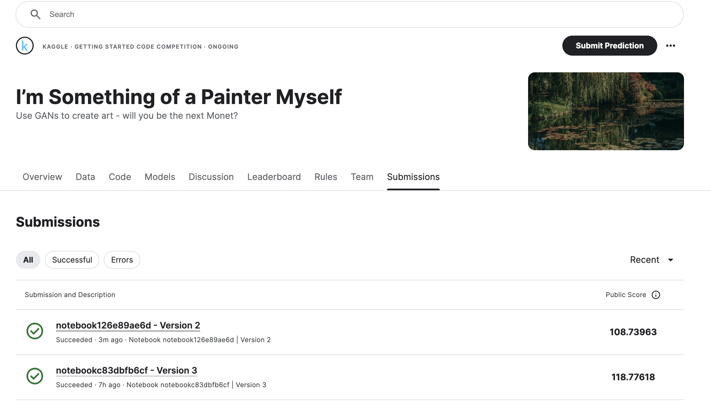
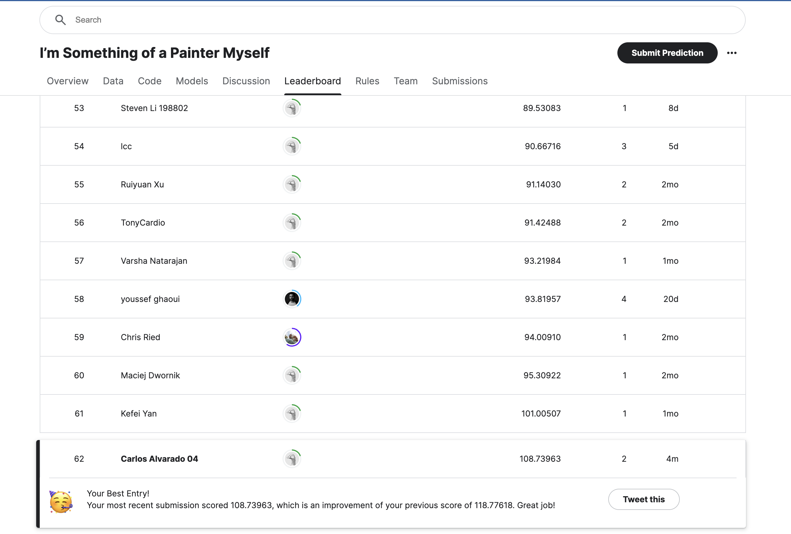

# README.md

## Kaggle I’m Something of a Painter Myself

### Description

“Every artist dips his brush in his own soul, and paints his own nature into his pictures.” - Henry Ward Beecher

We recognize the works of artists through their unique style, such as color choices or brush strokes. The “je ne sais quoi” of artists like Claude Monet can now be imitated with algorithms thanks to generative adversarial networks (GANs). In this getting started competition, you will bring that style to your photos or recreate the style from scratch!

Computer vision has advanced tremendously in recent years and GANs are now capable of mimicking objects in a very convincing way. But creating museum-worthy masterpieces is thought of to be, well, more art than science. So can (data) science, in the form of GANs, trick classifiers into believing you’ve created a true Monet? That’s the challenge you’ll take on!

### The Challenge

A GAN consists of at least two neural networks: a generator model and a discriminator model. The generator is a neural network that creates the images. For our competition, you should generate images in the style of Monet. This generator is trained using a discriminator.

The two models will work against each other, with the generator trying to trick the discriminator, and the discriminator trying to accurately classify the real vs. generated images.

Your task is to build a GAN that generates 7,000 to 10,000 Monet-style images.

### Author

Carlos Alvarado Martinez

## Exploratory Data Analysis (EDA)

### Dataset Overview

The dataset for this competition includes images of paintings by Claude Monet. The goal is to use these images to train a GAN to generate new Monet-style images.

### Visualizing the Data

Initial steps involved visualizing the dataset to understand the variety and characteristics of the images. This helps in determining the preprocessing steps needed for the GAN.

## Analysis

### Defining the Model

We will define the generator and discriminator models for the CycleGAN. The generator model will convert the input images to the target domain, while the discriminator model will classify the real and generated images.

### Generator and Discriminator Models

The generator model is responsible for converting input images to Monet-style images. We use downsample, upsample, and residual blocks to build this model.

The discriminator model classifies images as real or generated. It takes input images and passes them through convolutional layers for classification.

### Loss Functions

We define loss functions for both the generator and discriminator models. The generator loss function is the mean squared error, and the discriminator loss function is also the mean squared error of the real and fake images.

### Training the CycleGAN Model

We train the CycleGAN model using the `fit` method. The model is trained for 100 epochs with early stopping and learning rate reduction callbacks to prevent overfitting and improve performance.

## Methodology

### Early Stopping and Learning Rate Reduction

We use early stopping to halt training when the model performance stops improving, and learning rate reduction to adjust the learning rate dynamically during training.

### Plotting Training History

We plot the training history to visualize the generator and discriminator losses over epochs. This helps in understanding the training dynamics and detecting any potential issues.

### Generating Monet-Style Images

After training the model, we generate Monet-style images from the input photos using the trained generator model.

## Conclusions

Our approach successfully trained a CycleGAN to generate Monet-style images. The generated images were evaluated and scored on Kaggle, with the best submission achieving a score of 108.73963.

